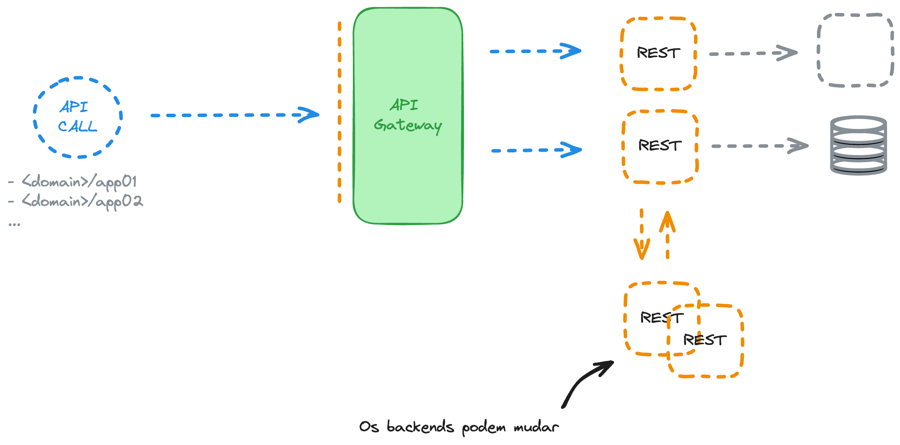

# Kong Gateway


Este repositório tem como o objetivo entender o que é um API Gateway, procedimentos para instalação do Kong Gateway versão comunity (free) no Kubernetes e trazer alguns exemplos de utilização e configuração com o objetivo de explorar suas funcionalidades.

## Conteúdo

<!--ts-->
  * [Requisitos](#Requisitos)
  * [O que é um API Gateway](#O-que-é-um-API-Gateway)
  * [Kong Gateway](#Kong-Gateway)
  * [Topologias de Instalação do Kong](#Topologias-de-Instalação-do-Kong)
  * [Hands-On](#Hands-On)
    * [Mostrando o Ambiente](#Mostrando-o-Ambiente)
    * [Examplo de configuração do banco de dados](#Examplo-de-configuração-do-banco-d-dados)
    * [Instalação Via Helm - Hybrid Mode](#Instalação-Via-Helm---Hybrid-Mode)
    * [Exemplos de Configurações](#Exemplos-de-Configurações)
<!--te-->

## Requisitos:

* Um cluster Kubernetes na versão `>= v1.28.x`
* Um bando de dados PostgreSQL `>= 12`
* Helm 3
* Um Certificado SSL para Ingress (opcional)

## O que é um API Gateway

É uma ferramenta de gerenciamento de API que atua entre o cliente (requisição) e uma gama de servidores (serviços), atua como um proxy reverso processando chamadas de API e as encaminhando para algum respectivo serviço em questão.

O processamento da requisição é baseado em políticas, que podem ser definidas no Path, Header, Query parameter da requisição e entre outros.



## Kong Gateway

O [Kong Gateway](https://docs.konghq.com/gateway/3.6.x/#main) é um API Gateway desenvolvido em cima do Nginx com o foco em multi-cloud, arquiteturas distribuidas e otimizado para microserviços. Conhecido pela gama de configurações que podemos realizar no ambiente através de modulos e plugins. Então podemos integra-lo na frente de diversas aplicações REST ou HTTP.

Uns dos seus diferencias é a possibilidade de diversos tipos de instalações.

## Topologias de Instalação do Kong

O Kong Gateway possui diversas possibilidades de instalação, no link abaixo temos a documentação de todos os modos:

[Deployment Topologies](https://docs.konghq.com/gateway/3.6.x/production/deployment-topologies/)


## Hands-On

### Mostrando o Ambiente

`Mostre o seu ambiente para o pessoal :)`

### Examplo de configuração do banco de dados

<details>

**Habilitando o repositório:**

`sudo sh -c 'echo "deb https://apt.postgresql.org/pub/repos/apt $(lsb_release -cs)-pgdg main" > /etc/apt/sources.list.d/pgdg.list'`
`wget --quiet -O - https://www.postgresql.org/media/keys/ACCC4CF8.asc | sudo apt-key add -`
`apt update`

**Instalação do PostgreSQL:**

`apt install postgresql -y`
`systemctl enable postgresql`
`systemctl status postgresql`

**Configuração do Banco:**

**Necessário logar no usuário postgres:**

`sudo -i -u postgres`

**Logando no banco e criando a database do Kong, usuário e role:**

`psql`
`CREATE DATABASE kong;`
`CREATE ROLE kong WITH LOGIN PASSWORD '<minha senha>';`
`CREATE ROLE kong_inc;`
`GRANT kong_inc TO kong;`
`GRANT ALL PRIVILEGES ON DATABASE kong TO kong_inc;`
`\c kong;`
`ALTER SCHEMA public OWNER TO kong_inc;`

**Agora a configuração de conexão externa ao banco de dados:**

`export PG_VERSION=$(ls /usr/lib/postgresql/)`
`sed -i "s/#listen_addresses = 'localhost'/listen_addresses = '*'/g" /etc/postgresql/$PG_VERSION/main/postgresql.conf`
`echo -e "# Kong Database\nhost    kong    kong    192.168.15.0/24 md5" >> /etc/postgresql/$PG_VERSION/main/pg_hba.conf`
`systemctl stop postgresql`
`systemctl start postgresql`
`systemctl status postgresql`

</details>

### Instalação Via Helm - Hybrid Mode

Agora iremos privionar um ambiente do Kong Gateway usando o modo de instalação Hybrid na versão 2.38.0.

Manifestos necessários antes de instalação:

1. Certificado do Cluster

```
openssl req -new -x509 -nodes -newkey ec:<(openssl ecparam -name secp384r1) \
  -keyout cluster.key -out cluster.crt \
  -days 1095 -subj "/CN=kong_clustering"
```

```
kubectl create secret tls kong-cluster-cert --cert=cluster.crt --key=cluster.key -n kong
```

```
kubectl create secret tls kong-cluster-cert --cert=cluster.crt --key=cluster.key -n kong-dp
```

2. Certificado do seu Dominio (opcional)
3. Senha do Banco de Dados
4. Criação dos namespaces
5. Manifestos do Kong Controlplane e do Kong Dataplane
6. Aplicações de examplo

<details>

Repositório do Helm Chart:

```
helm repo add kong https://charts.konghq.com
helm repo update
```

Kong Control Plane:

`helm upgrade --install kong kong/kong --namespace kong --values values.yaml --version 2.38.0`

Kong Dataplane:

`helm upgrade --install kong-dp kong/kong --namespace kong-dp --values values.yaml --version 2.38.0`
</details>

### Exemplos de Configurações

`Publicação de API e algumas configurações :)`

* Gateway Service
* Route
* Consumer
* IP Restriiction
* Autenticação via JWT em uma rota
* Autenticação via API Key
* Rate Limit

<details>

```
curl -X POST https://kong-admin-api.gondor.com.br/services \
  -H "Content-Type: application/json" \
  -d @- << 'EOF'
{
  "name": "application-02",
  "retries": 2,
  "protocol": "http",
  "host": "application-02.default.svc",
  "port": 8080,
  "path": "/",
  "connect_timeout": 10,
  "tags": ["application-02"],
  "enabled": true
}
EOF
```

```
curl -X POST https://kong-admin-api.gondor.com.br/routes \
  -H "Content-Type: application/json" \
  -d @- << 'EOF'
{
  "name": "application-02",
  "protocols": [
    "http"
  ],
  "methods": [
    "GET"
  ],
  "paths": [
    "/application-02"
  ],
  "preserve_host": true,
  "request_buffering": true,
  "response_buffering": true,
  "tags": [
    "application-02"
  ],
  "service": {
    "id": "50c6ac5e-5bac-462f-b3db-d12151fc746b"
  }
}
EOF
```

```
curl -X POST https://kong-admin-api.gondor.com.br/routes/application-02/plugins \
  -H "Content-Type: application/json" \
  -d @- << 'EOF'
{
  "config": {
    "header_names": [
      "Authorization"
    ],
    "key_claim_name": "iss",
    "claims_to_verify": [
      "exp"
    ],
    "maximum_expiration": 86400,
    "uri_param_names": [
      "jwt"
    ],
    "run_on_preflight": true
  },
  "tags": [
    "application-02"
  ],
  "instance_name": "application-02-jwt",
  "name": "jwt",
  "enabled": true,
  "route": {
    "id": "ec3ffa19-13e2-46f2-9965-5c01af5d9ca1"
  },
  "service": {
    "id": "50c6ac5e-5bac-462f-b3db-d12151fc746b"
  }
}
EOF
```

```
curl -X POST https://kong-admin-api.gondor.com.br/consumers \
  -H "Content-Type: application/json" \
  -d @- << 'EOF'
{
  "username": "application-02",
  "custom_id": "1234",
  "tags": [
    "application-02"
  ]
}
EOF
```

```
curl -X POST https://kong-admin-api.gondor.com.br/consumers/application-02/jwt \
  -H "Content-Type: application/json" \
  -d @- << 'EOF'
{
  "algorithm": "HS256",
  "key": "H8WBDhQlcfjoFmIiYymmkRm1y0A2c5WU",
  "secret": "n415M6OrVnR4Dr1gyErpta0wSKQ2cMzK",
  "tags": ["application-02"]
}
EOF
```

```
python main.py \
  -secret_key="n415M6OrVnR4Dr1gyErpta0wSKQ2cMzK" \
  -claim_key="H8WBDhQlcfjoFmIiYymmkRm1y0A2c5WU" \
  -claim_key_name="iss" \
  -set_expiration_token="Yes" \
  -expiration_token_age_in_days="1"
```

```
curl -X POST https://kong-admin-api.gondor.com.br/routes/application-02/plugins \
  -H "Content-Type: application/json" \
  -d @- << 'EOF'
{
  "name": "rate-limiting",
  "route": {
    "id": "ec3ffa19-13e2-46f2-9965-5c01af5d9ca1"
  },
  "service": {
    "id": "50c6ac5e-5bac-462f-b3db-d12151fc746b"
  },
  "instance_name": "application-02-rate-limit",
  "config": {
    "hour": 60,
    "minute": 1,
    "error_message": "voce excedeu o limite de chamada de api cabecudo"
  },
  "protocols": [
    "http",
    "https"
  ],
  "enabled": true,
  "tags": [
    "application-02"
  ]
}
EOF
```
</details>